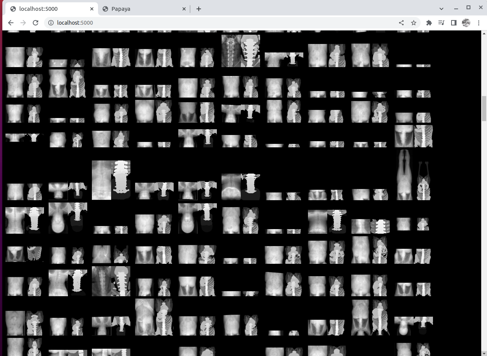
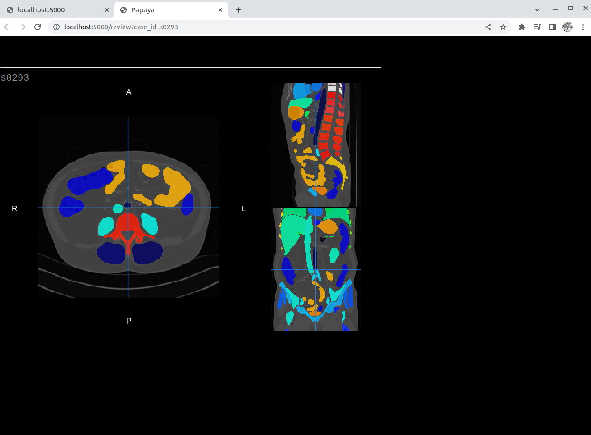

# totalsegmentator-and-friends


this repo contains a few scripts used to assess/review Totalsegmentator.


#### papaya (nginx+flask) to view image and segmentation

view wasserth/TotalSegmentator dataset* with rii-mongo/Papaya**
```
* https://github.com/wasserth/TotalSegmentator
** https://github.com/rii-mango/Papaya
```



```
 tunnel `$myserver:80` as `localhost:5000`

ssh -L 5000:127.0.0.1:80 $myserver

# build container
cd view
docker compose build

# prepare single segmentation (nii.gz) and png files.

export DATADIR=/mnt/scratch/data/Totalsegmentator_dataset
docker run -it -u $(id -u):$(id -g) -e DATADIR --init \
    -w ${PWD} -v /mnt:/mnt totalsegmentator-dataset-viewer-flask bash
python prepare.py

# 
#
# create `.env` and `volume.yml`, see examples: `.env.SAMPLE` and `volume.yml.SAMPLE`
# 
docker compose -f docker-compose.yml -f volume.yml up

```

#### assess segementation accuracy using publically available datasets.


+ for assessment on how it compares to manual contours in other datasets, see:

    + [Pediatric-CT-SEG assessment](assess/ped-ct-seg/README.md#results)

    + [AMOS2022 assessment](assess/amos22/README.md#results)


#### misc

```
There are only two hard things in Computer Science: cache invalidation and naming things.
-- Phil Karlton

Hence this repo name, the alternative would be totalsegmentator-misc-$(openssl rand -hex 4)

```
