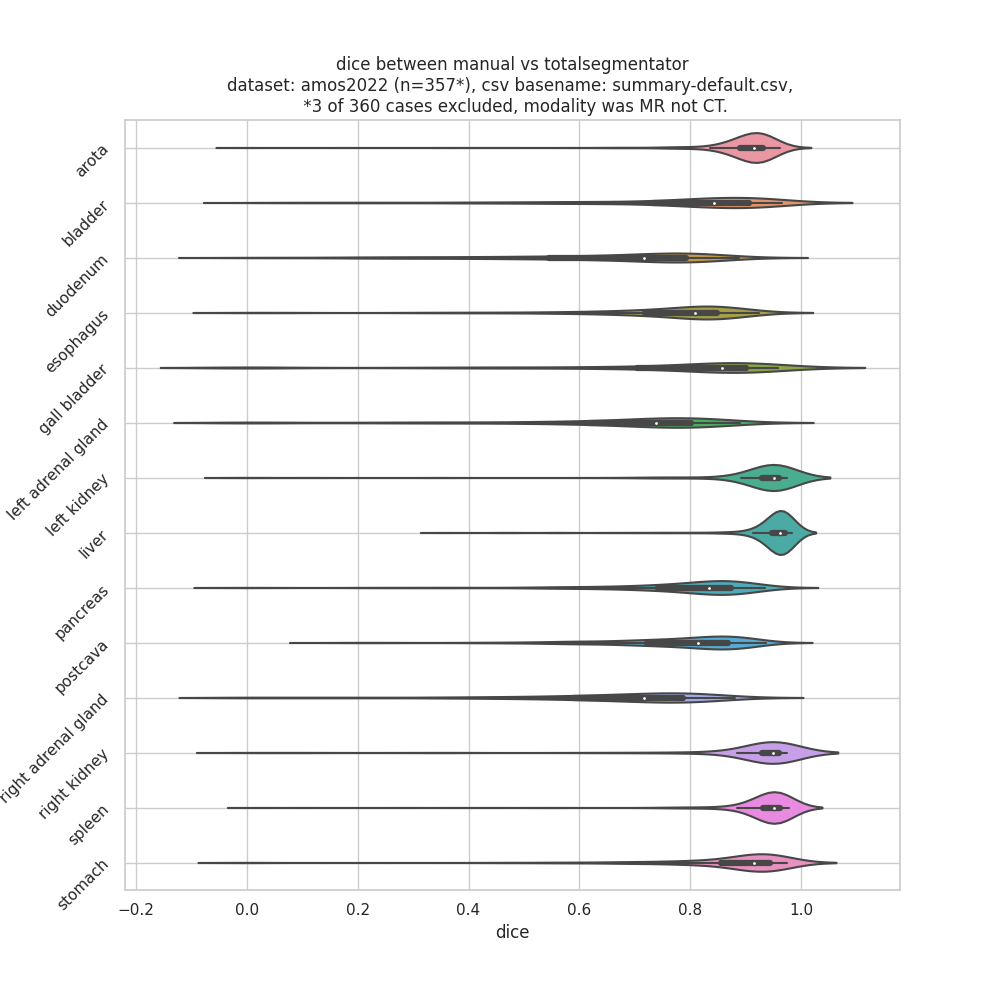

# instructions

```

# download amos

#inside docker
docker run -it -u $(id -u):$(id -g) \
    -w $PWD -v /mnt:/mnt pangyuteng/ml:latest bash
python gen_args.py /mnt/scratch/data/amos22 results

#outside docker
condor_subit_dag condor_dag

```

# results

Dice computed between manual contours and TotalSegmentor predictions using dataset AMOS2022 (n=359*)


* n=240 in imagesTr,n=120 in imagesVa, excluded `imagesTr/amos_0518.nii.gz` since is not CT, but more like MR.