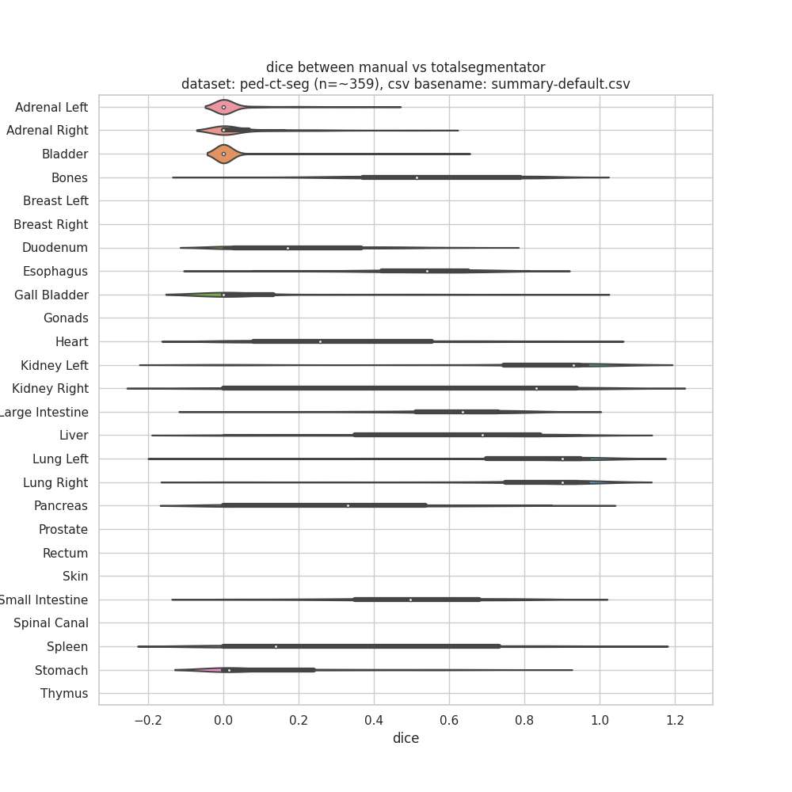

## dataset

dataset ped-ct-seg
https://wiki.cancerimagingarchive.net/pages/viewpage.action?pageId=89096588

## notes

+ download data and process dicom and segmentation to .nii.gz
https://github.com/pangyuteng/pediatric-ct-seg

+ run below to generate *.args
```
python gen_args.py $DATADIR $RESULTSDIR
```

+ (optional) clean up generated data from prior run (add `-delete` to delete)
```
cd $DATADIR
find . -name "liver.nii.gz" -print
find . -name "segmentations.nii.gz" -print
find . -name "scores.json" -print
```

+ submit inference and dice computation, and results aggregation DAG jobs.
```
rm condor.dag.* docker_stderror log/* results/*.csv
condor_submit_dag condor.dag
```

# results 

computing dice with manual vs totalsegmentator (with and without `--fast` flag) using dataset ped-ct-seg (n=~359)

dice(manual,totalsegmentator-default)


dice(manual,totalsegmentator-fast)


displaying above results ran with and without `--fast` flag


## notes

something doesn't seem right...

http://192.168.68.138/compare?case_id=Pediatric-CT-SEG-03A54FD1&dataset=ped-ct-seg
http://192.168.68.138/compare?case_id=Pediatric-CT-SEG-02AC04B6&dataset=ped-ct-seg

## containers used in condor jobs

https://github.com/wasserth/TotalSegmentator/blob/master/Dockerfile
https://github.com/pangyuteng/totalsegmentator-and-friends/blob/main/assess/docker-with-weights/Dockerfile
``` # contains model weights as one layer
docker pull pangyuteng/totalsegmentator:latest
```

https://github.com/pangyuteng/public-scratch/tree/master/ml-docker
```
docker pull pangyuteng/ml:latest
```
