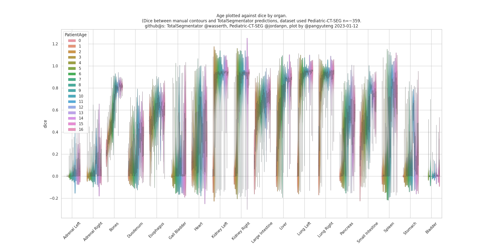

## dataset

dataset ped-ct-seg
https://wiki.cancerimagingarchive.net/pages/viewpage.action?pageId=89096588

## notes

+ download data and process dicom and segmentation to .nii.gz
https://github.com/pangyuteng/pediatric-ct-seg

+ run below to generate *.args
```
python gen_args.py $DATADIR $RESULTSDIR
```

+ (optional) clean up generated data from prior run (add `-delete` to delete)
```
cd $DATADIR
find . -name "liver.nii.gz" -print
find . -name "segmentations.nii.gz" -print
find . -name "scores.json" -print
```

+ submit inference and dice computation, and results aggregation DAG jobs.
```
rm condor.dag.* docker_stderror log/* results/*.csv
condor_submit_dag condor.dag
```

# results 

** DISCLAIMER, results to be verified, likely bugs present in my scripts. **

Dice computed using manual vs totalsegmentator (with and without `--fast` flag) contours using dataset ped-ct-seg (n=~359) (csvs available in `results` folder).

I don't quite believe the results yet (again see Dislaimer above), nevertheless, some observations are listed below:


+ As advertised, `--fast` indeed have a lower accuracy (assuming manual contours are good - i have not yet reviewed the ped-ct-seg contours) - not sure who got the adrenal l/r correct.

+ Lung & kidneys have fairly decent dice (>0.8), implying
    + [code used to download ped-ct-seg and convert to nifti](https://github.com/pangyuteng/pediatric-ct-seg) likely is correct.
    + [coded used to compute dice](process.py) between manual vs totalsegmentator contours likely is correct.

+ That said, a decent amount of organs (say bone, heart, spleen) that I think should have a dice > 0.6 have dice < 0.5! If model got the liver location "right" (>0.5), why is the spleen dice so low (<.2)? Could it be due to [contrast phases](https://en.wikipedia.org/wiki/Contrast_CT). Or is it just that organ size varies too much due to age, thus  model is unable to "generalize" - sets of adults organs is "vastly" different from younger organs...

    + lo and behold, below shows the age vs dice plot (liver and also all organs), dice does indeed drop as age decreases.  Interestingly the drop varies among organ. Thus, likely there is still bug/factors that contribute to the relatively lower dice in some organs. If we ignore adrenal and other small organs, how come we don't see the dice/age trend in heart, bladder? Further, why is deviation of dice relatively large?  (** AGAIN, still not ruling out potential bugs on my end **, and manual countour quality - )

    + why would dice in Bone drop with age? Maybe there is difference in contour SOP / how i'm aggregating the bone segment outputs from totalsegmentator.




## notes

something doesn't seem right...

http://gtx.local/compare?case_id=Pediatric-CT-SEG-03A54FD1&dataset=ped-ct-seg

http://gtx.local/compare?case_id=Pediatric-CT-SEG-02AC04B6&dataset=ped-ct-seg

## containers used in condor jobs

https://github.com/wasserth/TotalSegmentator/blob/master/Dockerfile

https://github.com/pangyuteng/totalsegmentator-and-friends/blob/main/assess/docker-with-weights/Dockerfile
``` # contains model weights as one layer
docker pull pangyuteng/totalsegmentator:latest
```

https://github.com/pangyuteng/public-scratch/tree/master/ml-docker
```
docker pull pangyuteng/ml:latest
```
